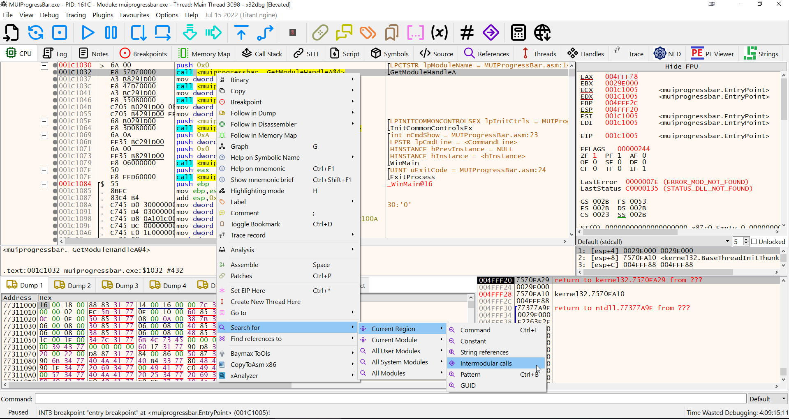

# TablerColoredIcons

x64dbg theme using colored tabler icons (https://github.com/tabler/tabler-icons)

# Installation

1. Download [TablerColoredIconsTheme.zip](https://github.com/mrfearless/TablerColoredIcons/blob/master/TablerColoredIconsTheme.zip?raw=true)

2. Unzip contents to  a `\x64dbg\themes\TablerColoredIcons` folder

3. Ensure the `TablerColoredIcons` theme folder contains `index.theme`, `style.css` and the `icons` folder and not another `TablerColoredIcons` folder - move files and folders if required.

4. Open x64dbg - either x86 or x64 version

5. Select **Options** -> **Themes** -> **TablerColoredIcons** theme to use the theme

6. Enjoy
